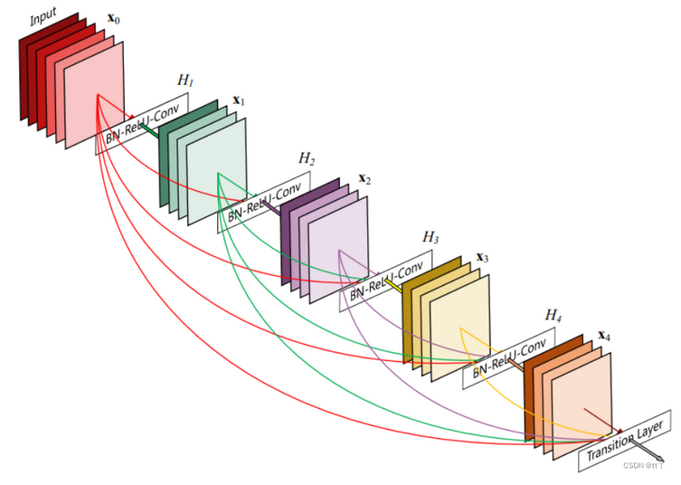
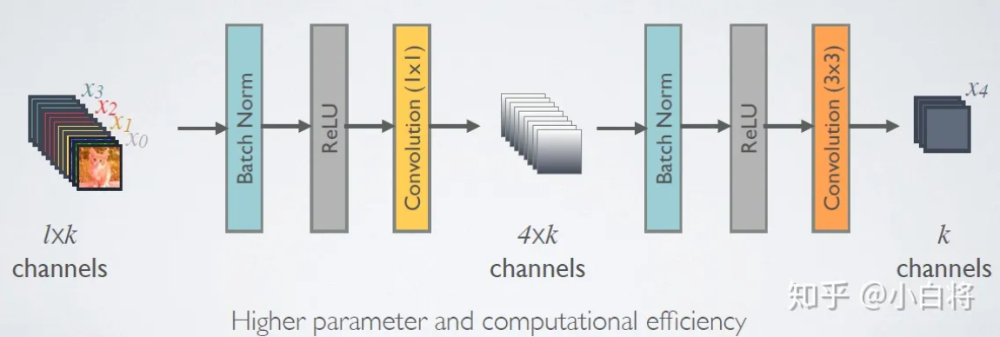
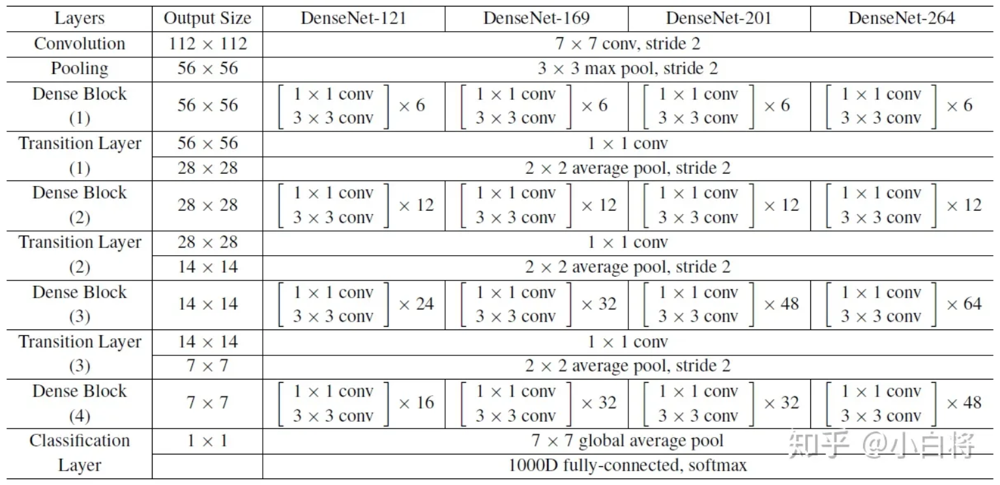
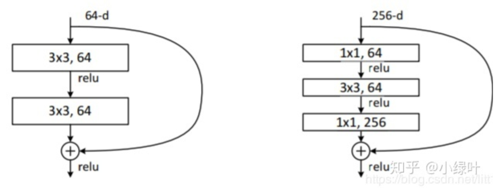
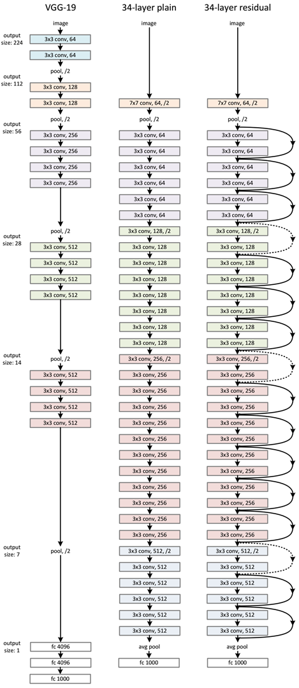
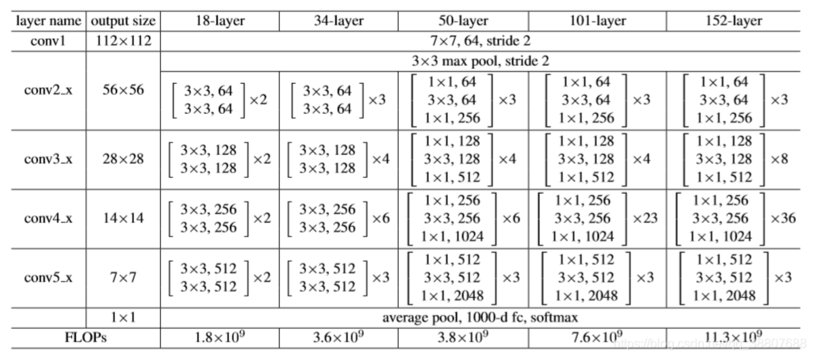
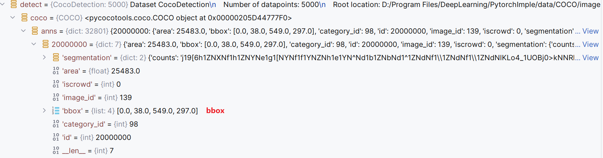

# 学习路径
1. 复现`DenseNet`
2. 复现`Resnet`
# 模型路径：models/
>官方源码路径：models/Official/

>已复现模型:测试模型文件及其路径 

- DenseNet:DenseNetEval.py

# 权重文件路径：Weights/

`densenet_cifar10.pth`

# 模型结构图
## DenseNet
设计理念：[DenseNet：比ResNet更优的CNN模型](https://zhuanlan.zhihu.com/p/37189203)
### 1. DenseBlock层

### 2. Transition层

### 3. DenseNet

## ResNet
> resnet有很多变形18/34/50/152。其中 `ResNet 18/34` 采用 `Basic Block` 作为基本单元，而 `ResNet 50/101/152` 则采用` BottleNeck`作为基本单元。
- 可以参考：[Resnet源码解读1](https://blog.csdn.net/qq_35091353/article/details/109776153)

### 1. BasicBlock/BottleNeck

`BottleNeck`分析：

- downsample是对x操作的，一般为None.当x和output的通道数不一致时，会通过downsample(x)使通道数一致。且downsample是一个1x1卷积。
- BasicBlock处理的图像维度是如何变化的？卷积计算公式
  - W'=(W-F+2P)/S
  - W'是卷积后的图像宽度,W是原图像宽度,F是卷积核宽度,P是填充,S是步长
  - 以卷积后的特征图的尺寸就跟步长很有关系。
  - BasicBlock虽然是经过两个3x3的卷积，但是前一个是设置了步长的(设置的步长是2)，后一个则是没有设置步长的，这意味着用的是默认步长(默认步长是1)。F=3，P=1，当S=1时，W是不变的； F=3，P=1，当S=2时，W会减少两倍.（参考ResNet.py的75-78行）

`BottleNeck`分析：

- 两个1x1卷积分别负责减少通道数量和恢复通道数量，从而为中间的 3*3 卷积降低参数量，虽然减少通道数量会有信息损失，但是影响不太大。比如这里第一个卷积将 256 维的 channel 先降到 64 维，然后再通过第二个卷积恢复到 256 维。
  - 整体的参数量为 (1x1x256)x64 + (3x3x64)x64 + (1x1x64)x256 = 69632，而使用 BasicBlock结构的话，就是两个 3x3x256 的卷积，参数数目为 (3x3x256)x256x2 = 1179648，相差 16.94 倍。
- 与基础版本的BasicBlock 不同的是这里有 3 个卷积，分别为1×1、3×3、1×1大小的卷积核，分别用于压缩维度、卷积处理、恢复维度。 
- 在使用 Bottleneck 时，它先对通道数进行压缩，再放大，所以传入的参数 planes 不是实际输出的通道数，而是 block 内部压缩后的通道数，真正的输出通道数为 plane*expansion
- 这样做的主要目的是，使用 Bottleneck 结构可以减少网络参数数量

`BasicBlock和BottleNeck的区别`:

* BasicBlock的卷积核都是2个3x3，Bottleneck则是一个1x1，3x3，1x1共三个卷积核组成。 
* BasicBlock的expansion为1，即输入和输出的通道数是一致的。而Bottleneck的expansion为4，即输出通道数是输入通道数的4倍。

- 不管是BasicBlock还是Bottleneck，最后都会做一个判断是否需要给x做downsample，因为必须要把x的通道数变成与输出的通道一致，才能相加

### 2. 整体（BasicBlock结构-ResNet34）

### 3. ResNet

- ResNet 共有五个阶段，其中第一阶段为一个 7*7 的卷积，stride = 2，padding = 3，然后经过 BN、ReLU 和 maxpooling，此时特征图的尺寸已成为输入的 1/4
- 接下来是四个阶段(con2_x,con3_x,con4_x,con5_x,)，也就是代码中 layer1，layer2，layer3，layer4。这里用 _make_layer 函数产生四个 Layer，需要用户输入每个 layer 的 box_block 数目（ 即layers列表 )以及采用的 block 类型（基础版 BasicBlock 还是 Bottleneck 版）
- _make_layer() 方法的第一个输入参数 block 选择要使用的模块是 BasicBlock 还是 Bottleneck 类，第二个输入参数 planes 是每个块的起始通道数（64，128，256，512），第三个输入参数 blocks 是每个 blocks 中包含多少个 residual 子结构。
- 从ResNet的forward()代码来看，它是先经过conv1()，bn，relu和maxpool(),从表格得知，这几层无论是resnet18，resnet34，resnet50，resnet101等等的resnet一开始都必须经过这几层，这是静态的。然后进入四层layer()，这是动态以的区别具体是resnet18，resnet34，resnet50，resnet101等等中的哪一个。

# 数据集学习路径：DataTest/

>解释：该路径设计pytorch向相关数据集的下载，加载等操作。仅供学习

## COCO

COCO数据集是不支持下载的，并且需要安装COCO API(直接安装pycocotools包就行)
ps:用conda安装：conda install -c conda-forge pycocotools

>参考PytorchImple/DataTest/COCOTest.py

可见关键是`bbox`

# 参考文章：[特别建议阅读]
- [CV【2】：卷积与Conv2d](https://blog.csdn.net/HoraceYan/article/details/125740051?ops_request_misc=%7B%22request%5Fid%22%3A%22171092224916800226536427%22%2C%22scm%22%3A%2220140713.130102334..%22%7D&request_id=171092224916800226536427&biz_id=0&spm=1018.2226.3001.4187)