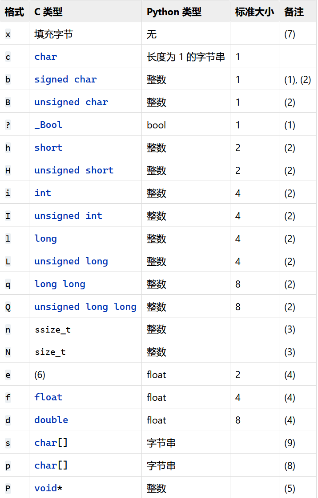

# Python补漏

## 序列类型

###  元组

**创建元组**
```commandline
>>> tup1 = ('Google', 'Runoob', 1997, 2000)
>>> tup2 = (1, 2, 3, 4, 5 )
>>> tup3 = "a", "b", "c", "d"  # 不需要括号也可以
>>> type(tup3)
<class 'tuple'>
```
`创建空元组`
>tup1 = ()

**当元组中只包含一个元素时，需要在元素后面添加逗号 , ，否则括号会被当作运算符使用：**
```commandline
>>> tup1 = (50)
>>> type(tup1)   # 不加逗号，类型为整型
<class 'int'>

>>> tup1 = (50,)
>>> type(tup1)   # 加上逗号，类型为元组
<class 'tuple'>
```


**访问元组**

`元组与字符串类似，下标索引从 0 开始，可以进行截取，组合等。`

`元组可以使用下标索引来访问元组中的值，如下实例:`
```commandline
tup1 = ('Google', 'Runoob', 1997, 2000)
tup2 = (1, 2, 3, 4, 5, 6, 7 )
 
print ("tup1[0]: ", tup1[0])
print ("tup2[1:5]: ", tup2[1:5])
```

**修改元组**
`元组中的元素值是不允许修改的，但我们可以对元组进行连接组合，如下实例:`
```commandline
#!/usr/bin/python3
 
tup1 = (12, 34.56)
tup2 = ('abc', 'xyz')
 
# 以下修改元组元素操作是非法的。
# tup1[0] = 100
 
# 创建一个新的元组
tup3 = tup1 + tup2
print (tup3)
```
**删除元组**

`元组中的元素值是不允许删除的，但我们可以使用del语句来删除整个元组，如下实例:`
```commandline
tup = ('Google', 'Runoob', 1997, 2000)
 
print (tup)
del tup
print ("删除后的元组 tup : ")
print (tup)

以上实例元组被删除后，输出变量会有异常信息，输出如下所示：
删除后的元组 tup : 
Traceback (most recent call last):
  File "test.py", line 8, in <module>
    print (tup)
NameError: name 'tup' is not defined

```
**元组运算符**

`与字符串一样，元组之间可以使用 +、+=和 * 号进行运算。这就意味着他们可以组合和复制，运算后会生成一个新的元组。`
a = (1,2,3)
b = (2,3,4)
- len(a) ,计算元素个数
- c=a+b ,组合一个新元组
- a+=b ,就地修改
- a*2 ,复制
- 3 in a ,判断存在
- for x in a:..  ,迭代

#### 命名元组

`collections.namedtuple(typename, field_names, verbose=False, rename=False) `
返回一个具名元组子类 typename，其中参数的意义如下：

    typename：元组名称
    field_names: 元组中元素的名称
    rename: 如果元素名称中含有 python 的关键字，则必须设置为 rename=True
    verbose: 默认就好 

下面来看看声明一个具名元组及其实例化的方法：
```
import collections

# 两种方法来给 namedtuple 定义方法名
#User = collections.namedtuple('User', ['name', 'age', 'id'])
User = collections.namedtuple('User', 'name age id')
user = User('tester', '22', '464643123')

print(user)
```
`具名元组的特有属性:`

类属性 
- _fields：包含这个类所有字段名 ;
- _make(iterable)：接受一个可迭代对象来生产这个类的实例 实例方法 ;
- _asdict()：把具名元组以 collections.OrdereDict 的形式返回，可以利用它来把元组里的信息友好的展示出来 ;
```python
from collections import namedtuple

# 定义一个namedtuple类型User，并包含name，sex和age属性。
User = namedtuple('User', ['name', 'sex', 'age'])

# 创建一个User对象
user = User(name='Runoob', sex='male', age=12)

# 获取所有字段名
print( user._fields )

# 也可以通过一个list来创建一个User对象，这里注意需要使用"_make"方法
user = User._make(['Runoob', 'male', 12])

print( user )
# User(name='user1', sex='male', age=12)

# 获取用户的属性
print( user.name )
print( user.sex )
print( user.age )

# 修改对象属性，注意要使用"_replace"方法
user = user._replace(age=22)
print( user )
# User(name='user1', sex='male', age=21)

# 将User对象转换成字典，注意要使用"_asdict"
print( user._asdict() )
# OrderedDict([('name', 'Runoob'), ('sex', 'male'), ('age', 22)])
```
Output:
```commandline
('name', 'sex', 'age')
User(name='Runoob', sex='male', age=12)
Runoob
male
12
User(name='Runoob', sex='male', age=22)
OrderedDict([('name', 'Runoob'), ('sex', 'male'), ('age', 22)])
```

## 映射类型

### 字典

字典的每个键值 key=>value 对用冒号 : 分割，每个对之间用逗号(,)分割，整个字典包括在花括号 {} 中 ,格式如下所示： 

`d = {key1 : value1, key2 : value2, key3 : value3 }`

注意：dict 作为 Python 的关键字和内置函数，变量名不建议命名为 dict。

**创建空字典**
```
# 使用大括号 {} 来创建空字典
emptyDict = {}
# 使用内置函数创建空字典
emptyDict = dict()

# 打印字典
print(emptyDict)

# 查看字典的数量
print("Length:", len(emptyDict))

# 查看类型
print(type(emptyDict))
```
**访问字典**

`把相应的键放入到方括号中，如下实例:`
```
tinydict = {'Name': 'Runoob', 'Age': 7, 'Class': 'First'}
 
print ("tinydict['Name']: ", tinydict['Name'])
print ("tinydict['Age']: ", tinydict['Age'])
```
**修改字典**

`向字典添加新内容的方法是增加新的键/值对，修改或删除已有键/值对`

```
tinydict = {'Name': 'Runoob', 'Age': 7, 'Class': 'First'}
 
tinydict['Age'] = 8               # 更新 Age
tinydict['School'] = "菜鸟教程"  # 添加信息
```

**删除字典元素**

`能删单一的元素也能清空字典，清空只需一项操作。显式删除一个字典用del命令，如下实例：`

```python
tinydict = {'Name': 'Runoob', 'Age': 7, 'Class': 'First'}
 
del tinydict['Name'] # 删除键 'Name'
tinydict.clear()     # 清空字典
del tinydict         # 删除字典

```
**字典键的特性**

`字典值可以是任何的 python 对象，既可以是标准的对象，也可以是用户定义的，但键不行。`

1. 不允许同一个键出现两次。创建时如果同一个键被赋值两次，后一个值会被记住，如下实例：
```python
tinydict = {'Name': 'Runoob', 'Age': 7, 'Name': '小菜鸟'}
 
print ("tinydict['Name']: ", tinydict['Name'])
# tinydict['Name']:  小菜鸟
```
2. 键必须不可变，所以可以用数字，字符串或元组充当，而用列表就不行，如下实例：
```python
tinydict = {['Name']: 'Runoob', 'Age': 7}
 
print ("tinydict['Name']: ", tinydict['Name'])
"""
Traceback (most recent call last):
  File "test.py", line 3, in <module>
    tinydict = {['Name']: 'Runoob', 'Age': 7}
TypeError: unhashable type: 'list'
"""
```

**内置函数**
- len(dict)
- str(dict)
- type(variable)

**内置方法**
- dict.clear()  删除字典内所有元素
- dict.copy()   返回一个字典的浅复制
- dict.fromkeys(seq[,value])  用于创建一个新字典，以序列 seq 中元素做字典的键，value 为字典所有键对应的初始值。
- dict.get(key,default=None)  返回指定键的值，如果键不在字典中返回 default 设置的默认值
- dict.items() 以列表返回视图对象，是一个可遍历的key/value 对。
- dict.keys()  返回键的视图对象
- dict.values() 返回值的视图对象
- dict.setdefault(key,default=None) 如果键不存在于字典中，将会添加键并将值设为默认值。
- dict.update(dict2) 把字典dict2的键/值对更新到dict里
- pop(key,[defalut])  删除字典 key（键）所对应的值，返回被删除的值。
  - 如果 key 存在 - 删除字典中对应的元素
  - 如果 key 不存在 - 返回设置指定的默认值 default
  - 如果 key 不存在且默认值 default 没有指定 - 触发 KeyError 异常

- popitem() 返回并删除字典中的最后一对键和值
  - 如果字典已经为空，却调用了此方法，就报出 KeyError 异常。


## 集合类型

### 集合
` 无序的不重复元素序列。`

`集合中的元素不会重复，并且可以进行交集、并集、差集等常见的集合操作。`

`可以使用大括号 { } 创建集合，元素之间用逗号 , 分隔， 或者也可以使用 set() 函数创建集合。`

**创建集合**
```python
parame = {value01,value02,...}
# 或者
set(value)
```
`注意`：创建一个空集合必须用 set() 而不是 { }，因为 { } 是用来创建一个空字典。 
```python
# 1.创建一个含有一个元素的集合

>>> my_set = set(('apple',))
>>> my_set
{'apple'}

# 2.创建一个含有多个元素的集合

>>> my_set = set(('apple','pear','banana'))
>>> my_set
{'apple', 'banana', 'pear'}

# 3.如无必要，不要写成如下形式

>>> my_set = set('apple') # 将字符串视为迭代
>>> my_set
{'l', 'e', 'p', 'a'}
>>> my_set1 = set(('apple')) # 不加逗号，等同上句
>>> my_set1
{'l', 'e', 'p', 'a'}
```


**集合操作**
1. 添加元素
   ```python
   s.add( x ) # 将元素 x 添加到集合 s 中，如果元素已存在，则不进行任何操作
   s.update( x ) # 还有一个方法，也可以添加元素，且参数可以是列表，元组，字典等
   ```
   ```python
    s.update( {"字符串"} ) # 将字符串添加到集合中，有重复的会忽略。
    s.update( "字符串" ) # 将字符串拆分单个字符后，然后再一个个添加到集合中，有重复的会忽略。 

    >>> thisset = set(("Google", "Runoob", "Taobao"))
    >>> print(thisset)
    {'Google', 'Runoob', 'Taobao'}
    >>> thisset.update({"Facebook"})
    >>> print(thisset) 
    {'Google', 'Runoob', 'Taobao', 'Facebook'}
    >>> thisset.update("Yahoo")
    >>> print(thisset)
    {'h', 'o', 'Facebook', 'Google', 'Y', 'Runoob', 'Taobao', 'a'}
    >>>
    ```     
2. 移除元素
   ```python
   s.remove( x ) # 将元素 x 从集合 s 中移除，如果元素不存在，则会发生错误
   s.discard( x ) # 还有一个方法也是移除集合中的元素，且如果元素不存在，不会发生错误
   s.pop() # 设置随机删除集合中的一个元素(set 集合的 pop 方法会对集合进行无序的排列，然后将这个无序排列集合的左面第一个元素进行删除)
   ```
   计算集合元素个数
   ```python
   len(s)
   ```
   
3. 清空集合
    ```python
    s.clear()
    ```
   
4. 判断元素是否在集合中存在
    ```python
    x in s
    ```
   


**内置方法**

- add()为集合添加元素 
- clear()	移除集合中的所有元素 
- copy()	拷贝一个集合 
- difference()	返回多个集合的差集 
- difference_update()	移除集合中的元素，该元素在指定的集合也存在。 
- discard()	删除集合中指定的元素 
- intersection()	返回集合的交集 
- intersection_update()	返回集合的交集。 
- isdisjoint()	判断两个集合是否包含相同的元素，如果没有返回 True，否则返回 False。 
- issubset()	判断指定集合是否为该方法参数集合的子集。 
- issuperset()	判断该方法的参数集合是否为指定集合的子集 
- pop()	随机移除元素 
- remove()	移除指定元素 
- symmetric_difference()	返回两个集合中不重复的元素集合。 
- symmetric_difference_update()	移除当前集合中在另外一个指定集合相同的元素，并将另外一个指定集合中不同的元素插入到当前集合中。 
- union()	返回两个集合的并集 
- update()	给集合添加元素 
- len()	计算集合元素个数


## 二进制序列类型

### 内存视图memoryview

>用途：（处理大型数据）

1）类似C语言指针,通过memory访问内部数据;无内存拷贝 ;

2）不复制内容前提下在数据结构之间共享内存；数据结构可是任何形式，如PIL图片，SQLite数据库，Numpy的数组等
 
3）将内存视图转为新格式或形状（底层对象可写支持一维切片；禁调大小）
- 零维内存视图可以使用空元组索引。
- 一维记忆体视图可以用一个整数或一个整数元组索引。
- 多维内存视图可以用精确ndim整数的元组索引，其中ndim是维数。


> memoryview 对象允许 Python 代码访问一个对象的内部数据，只要该对象支持 缓冲区协议 


`class memoryview(object)`
> 创建一个引用 object 的 memoryview 。 object 必须支持缓冲区协议。支持缓冲区协议的内置对象有 `bytes` 和 `bytearray`

```python
# 创建：class memoryview(obj)#参数：obj(bytes, bytearray)必支持缓冲区协议

# 方法
v=memoryview(b'abc')
    
v.hex()      #返回缓冲区中数据十六进制str：'616263'
v.release() #释放底层缓冲区;此后对视图操作引发ValueError
v.tolist()  # 将缓冲区内的数据以一个元素列表的形式返回。
v.tobytes() # 将缓冲区中的数据作为字节串返回。相当于在内存视图上调用bytes构造器
v.toreadonly() # 返回 memoryview 对象的只读版本。原始的 memoryview 对象不会被改变
v.cast(格式[，形状])           #返回新形状的内存视图（默认1D）
# 支持的阵列是1D->C-连续和C连续-> 1D
# 目标格式在struct语法上仅限于单个元素原生格式。
# 其一种格式必是字节格式B，b或c结果的字节长度必须与原始长度相同。
 
    v = memoryview(array.array('H', [1, 2, 3]))
    v.itemsize                          # 2
    struct.calcsize('H') == v.itemsize  # True
 
# 切片
v=memoryview(bytearray(b'hello'))
v[0] == b'hello'[0] == 104
v[1:4].tobytes()==bytes(v[1:4])# b'ell'
v[:2]=b'NO'                    #修改会影响原对象（类似list)
v.tobytes()                    # b'NOllo'
 
# 定义一个打印方法和属性结果的函数：
def viewAttributeMethod(v,format=None,shape=None):
    # 切片
    v1 = v[0]
    v2 = v[0:1]
    print('slice=',v1, v2)
 
    # 属性
    v1=v.contiguous  # 指示内存是否连续bool
    v2=v.c_contiguous# 指示内存是否为C连续的bool
    v3=v.f_contiguous# 指示内存是否为Fortran连续bool
    v4=v.format      # 视图中的每个元素的格式
    v5=v.itemsize    # 每个元素的大小（字节）
    v6=v.nbytes      # 数组将在连续表示中使用空间大小(字节)
    v7=v.ndim        # 数组维数
    v8=v.obj         # 内存视图基础对象
    v9=v.readonly    # 内存是否为只读（bytes为只读，bytearray为读写）
    va=v.shape       # 数组形状
    vb=v.strides     # n个整数的元组，以字节为单位来访问数组的每个维度的每个元素
    vc=v.suboffsets  # 内部用于PIL样式数组的整数元组
    print('attribute=',v1,v2,v3,v4,v5,v6,v7,v8,v9,va,vb,vc)
 
    # 方法
    v1=v.hex()    # 将缓冲区数据作为16进制str返回
    v2=v.tobytes()# 将缓冲区数据作为字节返回
    v3=v.tolist() # 将缓冲区数据作为列表返回
    print('method=',v1,v2,v3)
    # v4=v.cast(format,shape)# 将内存视图转换为新的格式或形状
    v.release()   # 释放内存视图对象基础缓冲区
    # print('case=',v4)
 
v1=memoryview(b'hello')
viewAttributeMethod(v1)

# Output
"""
slice= 104 <memory at 0x0000000004931B88>
attribute= True True True B 1 5 1 b'hello' True (5,) (1,) ()
method= 68656c6c6f b'hello' [104, 101, 108, 108, 111]
"""
```

```
# 实例2：struct
import array,struct
nbytes == product(shape) * itemsize == len(m.tobytes())
# 这是数组在连续表示中使用的空间数量。它不一定等于len（m）
 
buf = struct.pack("i"*12, *list(range(12)))# b'...'
v= memoryview(buf)
v.format#'B'
v.itemsize*len(v)==v.nbytes# True 1*48=48
 
a = v.cast('i', shape=[2,2,3])
a.tolist()#[[[0,1,2],[3,4,5]],[[6,7,8],[9,10,11]]]
```
```
# 实例3：切片
v = memoryview(bytearray(b'hello'))
v[0]=ord('T');v.tobytes() #b'Tello'
v[0]=b'T'                 #错误
v[0:2]=b'NO';v.tobytes()  #b'NOllo'
v[0:2]=[ord('t'),ord('s')]#错误
 
v = memoryview(array.array('i', [1, 2, 3, 4, 5,6]))
v.tolist()                  #[ 1,2,3,4,5,6]
v[0]=-1;v.tolist()          #[-1,2,3,4,5,6]
 
v = memoryview(struct.pack("d"*12, *[x for x in range(6)]))
y = v.cast('d',shape=[2, 3])#只读
y.tolist()        #[[0.0, 1.0, 2.0],[3.0, 4.0, 5.0]]
 ```
```
# 实例4：比较
#格式B，b或c可哈希只读类型支持一维切片哈希被定义为：
hash(m) == hash(m.tobytes())
v = memoryview(b'abcefg')
print(hash(v) == hash(b'abcefg'))             # True 2939035943579119696
print(hash(v[2:4]) == hash(b'ce'))            # True
print(hash(v[::-2]) == hash(b'abcefg'[::-2])) # True
```

`cast转换的格式：`




--------


## 数组（array库）
> 数组array.array .来自array库的高效数字数组

> 导入array.array
```python
from array import array
```


`array库的介绍`：
>此模块定义了一种对象类型，可以紧凑地表示由基本值（字符、整数、浮点数）组成的数组。数组是序列类型，其行为与列表非常相似，不同之处在于其中存储的对象类型是受限的，在数组对象创建时用单个字符的 类型码 来指定。

已定义的`类型码`如下：


`使用array.array教程`
> class array.array(typecode[, initializer])
> 
> 1. typecode:元素类型代码 
> 2. initializer:初始化器，就是要在这个地方放一个包含数值的数组，若创建一个空的数组，则省略初始化器

`示例：`
````python
>>> from array import array   
>>> from random import random
>>> floats = array('d', (random() for i in range(10**7)))   #利用一个可迭代对象来建立一个双精度浮点数组（类型码是 'd'），这里我们用的可迭代对象是一个生成器表达式；random() 方法返回随机生成的一个实数，它在[0,1)范围内。
>>> floats[-1]  #查看数组的最后一个元素
0.07802343889111107

>>> with open('floats.bin', 'wb') as fp:
>>>     floats.tofile(fp) #把数组floats存入一个二进制文件fp里，这就是array。tofile的用法

>>> floats2 = array('d') #新建一个双精度浮点空数组
>>> with open('floats.bin', 'rb') as fp:
>>>     floats2.fromfile(fp, 10**7) #从文件fp中把 1000 万个浮点数从二进制文件里读取出来；在array.fromfile（）中，第一个参数是文件名，第二个参数是指读取多少个数值出来

>>> floats2[-1] #查看新数组的最后一个元素
0.07802343889111107

>>> floats2 == floats #检查两个数组的内容是不是完全一样
True

````
`array的属性和方法:`
- array.typecodes # 查看所有可用类型代码
- array.typecode  # 在创建数组时使用的类型码字符
- array.itemsize #  查看数组元素个数
------
- **array.append(x)** # 添加一个值为 x 的新项到数组末尾 
- **array.extend(iterable)** # 将来自 iterable 的项添加到数组末尾。


- array.buffer_info() # 获取数组在存储器中的地址、元素的个数，返回一个元组：（地址、长度）
- array.byteswap() # 翻转数组内每个元素的字节序列，转换字节序


- array.index(x[, start[, stop]]) # 返回以这样的方式找到的最小的 i：i 为数组中第一个 x 的下标。可选参数 start 和 stop 用于在数组的一个指定的子段中搜索x
- array.insert(i, x) # 在数组的位置 i 之前插入一个值为 x 的新项。负值被视为相对于数组末尾的位置
- array.pop([i]) #从数组中移除下标为 i 的项并将其返回。参数默认值为 -1，因此默认移除并返回末项
- array.remove(x) # 从数组中移除第一个出现的 x。
- array.reverse() #  反转数组中各项的顺序。


- array.frombytes(b) # 将压缩成机器值的字节序列读出来添加到尾部
- **array.fromfile(f, n)** # 将二进制文件 f 内含有机器值读出来添加到尾部，最多添加 n 项 
- array.fromlist(l) # 将列表里的元素添加到尾部，如果其中任何一个元素导致了 TypeError 异常，那么所有的添加都会取消
- array.fromunicode(s) # 使用来自给定的 Unicode 字符串的数据扩展该数组。该数组的类型码必须为 'u'；否则将引发 ValueError。


- array.tobytes() # 把所有元素的机器值用 bytes 对象的形式返回
- **array.tofile(f)** # 把所有元素以机器值的形式写入一个文件
- array.tolist() # 把数组转换成列表，列表里的元素类型是数字对象


`内置函数`:

- s.\_\_iadd\_\_(s2) ：s += s2，就地拼接
- s.\_\_contains\_\_(e) ：s 是否含有 e
- s.\_\_copy\_\_() ：对 copy.copy 的支持
- s.\_\_delitem\_\_(p) ：删除位置 p 的元素
- s.\_\_getitem\_\_(p) ：s[p]，读取位置 p 的元素
- s.\_\_iter\_\_() ：返回迭代器 
- s.\_\_len\_\_() ：len(s)，序列的长度 
- s.\_\_mul\_\_(n) ：s * n，重复拼接 
- s.\_\_imul\_\_(n) ：s *= n，就地重复拼接 
- s.\_\_rmul\_\_(n) ：n * s，反向重复拼接*
- s.\_\_setitem\_\_(p,e) ：s[p] = e，把位于 p 位置的元素替换成 e 


## 容器数据类型(collections库)

